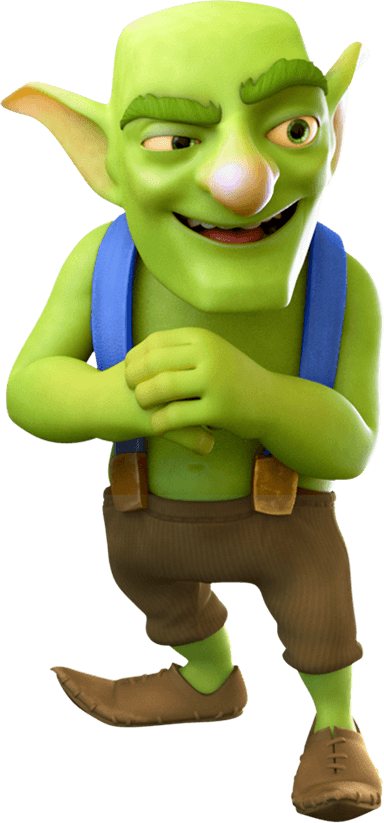

# Goblin (Nome Desconhecido)
[Voltar](../npcs/npcs-index.md)

## Imagem (Não é a Imagem Final)

 

* Matriz IA: Funny happy friendly Dungeons and Dragons Gobling drinking beer in a tavern with his friends using a red tshirt with a white dragon logo on the shirt : 55mm: tavern : fantasy style : higly detailed :  8k, --ar 9:16

## Caracteristicas Fisicas

* **Nome:** Desconhecido

* **Sexo:** 
    *   [X] Masculino 
    *   [ ] Feminino

* **Raça:** Goblin

* **Classe:** Desconhecido

* **Nivel:** Desconhecido

* **Descrição:** Taverneiro da [Taverna Unicórnio Saltitante](../locations/Taverna-Unicornio-Saltitante.md), animado e descolado porem muito misterioso o Goblin é conhecido em toda a cidade. Suas raizes ninguem conhece e parece que ninguem se lembra de quando ele chegou na cidade, para todos ele esta na cidade desde que se lembram da cidade.

## Observaçoes e Anotações dos Jogadores: